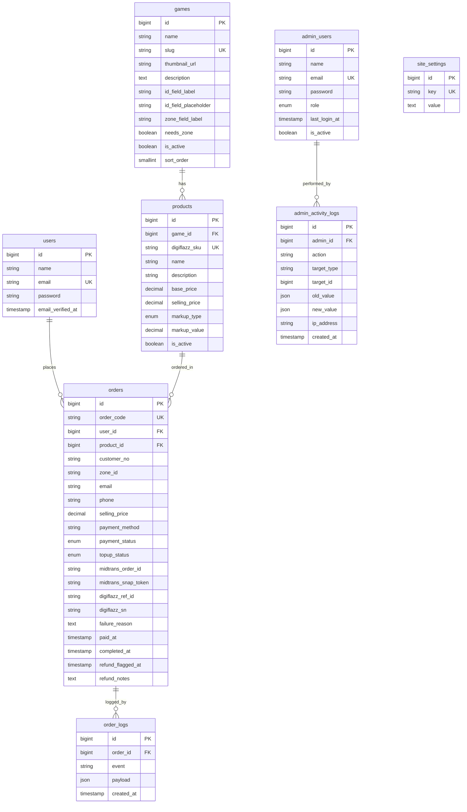

# Database Schema & Laravel Migration Guide

Berikut adalah panduan struktur tabel database dan padanan tipenya jika Anda menulisnya menggunakan Laravel Migration (`Blueprint`).

## Entity Relationship Diagram (ERD)

---

## 1. Table: `users`
Digunakan untuk mencatat data user/customer terdaftar.

| Nama Kolom | Tipe Data Laravel Migration | Keterangan / Modifier |
|---|---|---|
| `id` | `$table->id();` | Primary Key (BigInteger Auto Increment) |
| `name` | `$table->string('name', 100);` | Nama lengkap |
| `email` | `$table->string('email', 255)->unique();` | Alamat email unik |
| `password` | `$table->string('password', 255);` | Hashed password |
| `email_verified_at` | `$table->timestamp('email_verified_at')->nullable();` | Tanggal verifikasi email |
| `created_at` / `updated_at` | `$table->timestamps();` | Otomatis dibuat oleh Laravel |

---

## 2. Table: `games`
Kategori game yang terdaftar di platform.

| Nama Kolom | Tipe Data Laravel Migration | Keterangan / Modifier |
|---|---|---|
| `id` | `$table->id();` | Primary Key |
| `name` | `$table->string('name', 100);` | Nama Game |
| `slug` | `$table->string('slug', 100)->unique();` | URL Slug unik |
| `thumbnail_url` | `$table->string('thumbnail_url', 500)->nullable();` | Path gambar game |
| `description` | `$table->text('description')->nullable();` | Deskripsi singkat game |
| `id_field_label` | `$table->string('id_field_label', 50)->default('User ID');` | Label form ID game |
| `id_field_placeholder` | `$table->string('id_field_placeholder', 100)->nullable();` | Placeholder input ID game |
| `zone_field_label` | `$table->string('zone_field_label', 50)->default('Zone/Server ID');` | Label zone ID game |
| `needs_zone` | `$table->boolean('needs_zone')->default(false);` | Apakah game butuh Server ID |
| `is_active` | `$table->boolean('is_active')->default(true);` | Status aktifasi kategori game |
| `sort_order` | `$table->smallInteger('sort_order')->default(0);` | Urutan tampil kategori game |
| `created_at` / `updated_at` | `$table->timestamps();` | Standard Laravel timestamps |

---

## 3. Table: `products`
Detail denominasi produk top-up yang didapat dari Digiflazz.

| Nama Kolom | Tipe Data Laravel Migration | Keterangan / Modifier |
|---|---|---|
| `id` | `$table->id();` | Primary Key |
| `game_id` | `$table->foreignId('game_id')->constrained('games');` | Relasi ke `games.id` |
| `digiflazz_sku` | `$table->string('digiflazz_sku', 100)->unique();` | SKU Code Digiflazz unik |
| `name` | `$table->string('name', 200);` | Nama denominasi/item |
| `description` | `$table->string('description', 500)->nullable();` | Deskripsi produk |
| `base_price` | `$table->decimal('base_price', 15, 2);` | Cost dari H2H Digiflazz |
| `selling_price` | `$table->decimal('selling_price', 15, 2);` | Harga jual akhir ke user |
| `markup_type` | `$table->enum('markup_type', ['flat', 'percent'])->default('flat');` | Jenis markup |
| `markup_value` | `$table->decimal('markup_value', 10, 2)->default(0);` | Nilai markup |
| `is_active` | `$table->boolean('is_active')->default(false);` | Default non-aktif |
| `created_at` / `updated_at` | `$table->timestamps();` | Standard Laravel timestamps |

* **Index Tambahan:**
  `$table->index(['game_id', 'is_active']);` (untuk optimasi query filter produk aktif per game)

---

## 4. Table: `orders`
Mencatat transaksi top-up secara transaksional.

| Nama Kolom | Tipe Data Laravel Migration | Keterangan / Modifier |
|---|---|---|
| `id` | `$table->id();` | Primary Key |
| `order_code` | `$table->string('order_code', 30)->unique();` | AZKA-YYYYMMDD-XXXXX |
| `user_id` | `$table->foreignId('user_id')->nullable()->constrained('users')->nullOnDelete();` | Relasi ke `users.id` (NULL jika guest) |
| `product_id` | `$table->foreignId('product_id')->constrained('products');` | Relasi ke `products.id` |
| `customer_no` | `$table->string('customer_no', 100);` | Game User ID tujuan |
| `zone_id` | `$table->string('zone_id', 50)->nullable();` | Game Zone/Server ID (jika ada) |
| `email` | `$table->string('email', 255);` | Email penerima receipt |
| `phone` | `$table->string('phone', 20)->nullable();` | Nomor telepon pembeli |
| `selling_price` | `$table->decimal('selling_price', 15, 2);` | Harga terkunci saat order dibuat |
| `payment_method` | `$table->string('payment_method', 50)->nullable();` | Metode: qris, gopay, dll. |
| `payment_status` | `$table->enum('payment_status', ['pending','paid','expired','failed','cancelled'])->default('pending');` | Status pembayaran Midtrans |
| `topup_status` | `$table->enum('topup_status', ['pending','processing','completed','failed'])->default('pending');` | Status eksekusi Digiflazz |
| `midtrans_order_id` | `$table->string('midtrans_order_id', 100)->nullable();` | ID transaksi di Midtrans |
| `midtrans_snap_token`| `$table->string('midtrans_snap_token', 500)->nullable();` | Snap Token untuk Snap.js popup |
| `digiflazz_ref_id` | `$table->string('digiflazz_ref_id', 100)->nullable();` | Ref ID H2H (= order_code) |
| `digiflazz_sn` | `$table->string('digiflazz_sn', 500)->nullable();` | SN / Bukti Token sukses |
| `failure_reason` | `$table->text('failure_reason')->nullable();` | Alasan gagal dari Digiflazz |
| `paid_at` | `$table->timestamp('paid_at')->nullable();` | Waktu pembayaran sukses |
| `completed_at` | `$table->timestamp('completed_at')->nullable();` | Waktu pengiriman top-up sukses |
| `refund_flagged_at`| `$table->timestamp('refund_flagged_at')->nullable();` | Ditandai butuh refund manual |
| `refund_notes` | `$table->text('refund_notes')->nullable();` | Catatan proses refund |
| `created_at` / `updated_at` | `$table->timestamps();` | Standard Laravel timestamps |

* **Index Tambahan untuk Optimasi:**
  * `$table->index(['user_id', 'created_at']);` (optimasi riwayat transaksi user)
  * `$table->index(['payment_status', 'topup_status', 'created_at']);` (optimasi dashboard monitoring admin)
  * `$table->index('digiflazz_ref_id');` (optimasi idempotency check)

---

## 5. Table: `order_logs`
Mencatat history/timeline proses transaksi.

| Nama Kolom | Tipe Data Laravel Migration | Keterangan / Modifier |
|---|---|---|
| `id` | `$table->id();` | Primary Key |
| `order_id` | `$table->foreignId('order_id')->constrained('orders')->cascadeOnDelete();` | Relasi ke `orders.id` |
| `event` | `$table->string('event', 100);` | Event log (e.g. payment_confirmed) |
| `payload` | `$table->json('payload')->nullable();` | Raw JSON response/request API |
| `created_at` | `$table->timestamp('created_at')->useCurrent();` | Waktu log dibuat |

---

## 6. Table: `admin_users`
Akun administrator platform.

| Nama Kolom | Tipe Data Laravel Migration | Keterangan / Modifier |
|---|---|---|
| `id` | `$table->id();` | Primary Key |
| `name` | `$table->string('name', 100);` | Nama admin |
| `email` | `$table->string('email', 255)->unique();` | Email login admin unik |
| `password` | `$table->string('password', 255);` | Hashed password |
| `role` | `$table->enum('role', ['super_admin','operator'])->default('operator');` | Role hak akses |
| `last_login_at` | `$table->timestamp('last_login_at')->nullable();` | Terakhir kali login |
| `is_active` | `$table->boolean('is_active')->default(true);` | Status keaktifan admin |
| `created_at` / `updated_at` | `$table->timestamps();` | Standard Laravel timestamps |

---

## 7. Table: `admin_activity_logs`
Mencatat seluruh aksi sensitif yang dilakukan oleh admin.

| Nama Kolom | Tipe Data Laravel Migration | Keterangan / Modifier |
|---|---|---|
| `id` | `$table->id();` | Primary Key |
| `admin_id` | `$table->foreignId('admin_id')->constrained('admin_users')->cascadeOnDelete();` | Relasi ke `admin_users.id` |
| `action` | `$table->string('action', 100);` | Aksi (e.g. edit_product, manual_retry) |
| `target_type` | `$table->string('target_type', 100)->nullable();` | Nama model (e.g. product) |
| `target_id` | `$table->unsignedBigInteger('target_id')->nullable();` | ID dari model target |
| `old_value` | `$table->json('old_value')->nullable();` | Nilai data sebelum diubah |
| `new_value` | `$table->json('new_value')->nullable();` | Nilai data sesudah diubah |
| `ip_address` | `$table->string('ip_address', 45)->nullable();` | Alamat IP admin |
| `created_at` | `$table->timestamp('created_at')->useCurrent();` | Waktu aksi dicatat |

---

## 8. Table: `site_settings`
Penyimpan pengaturan platform dinamis (key-value store).

| Nama Kolom | Tipe Data Laravel Migration | Keterangan / Modifier |
|---|---|---|
| `id` | `$table->id();` | Primary Key |
| `key` | `$table->string('key', 100)->unique();` | Nama konfigurasi unik |
| `value` | `$table->text('value')->nullable();` | Isi konfigurasi (bisa berupa JSON text) |
| `created_at` / `updated_at` | `$table->timestamps();` | Standard Laravel timestamps |

* **Default records (seed):**
  * `maintenance_mode` = `0`
  * `announcement_banner` = `''`
  * `digiflazz_balance_alert_threshold` = `500000`
  * `payment_methods_enabled` = `{"qris":1,"gopay":1,"dana":1,"shopeepay":1,"bca_va":1,"bni_va":1,"mandiri_bill":1}`
